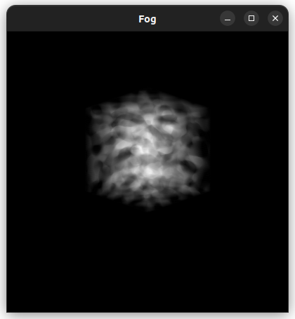

# Volume Ray Caster

## About

This is a project I created to learn about [Volume Ray Casting](https://en.wikipedia.org/wiki/Volume_ray_casting). 

### To do

- ~~Get three-dimensional perlin noise data~~
- ~~Basic compositing~~
- ~~Calculate the gradient~~
- ~~Perform Barycentric interpolation~~
- ~~Create a viewing plane~~
- ~~Implement Blinn-Phong lighting~~
- ~~Performance benchmarking~~
- More advanced compositing
- Save images
- Ray intersection
- Perspective projecting
- Trilinear interpolation
- Nearest neighbor interpolation